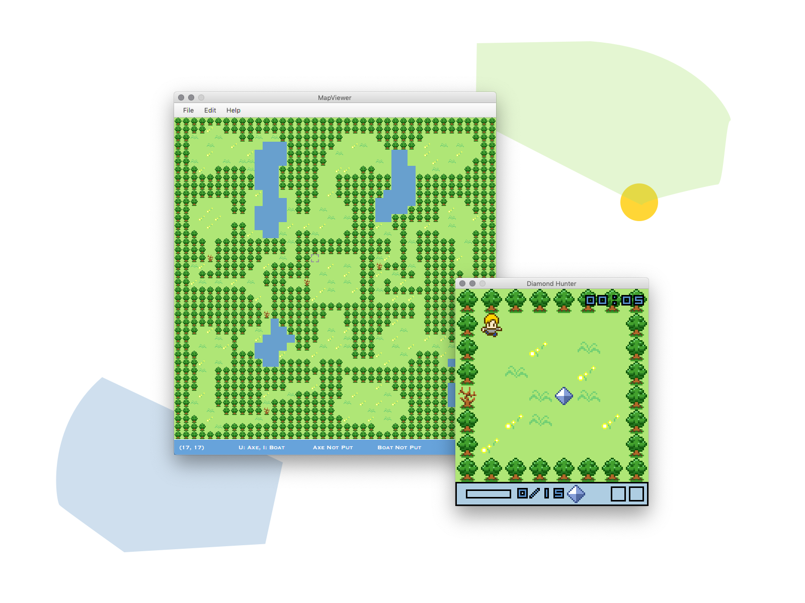

# Game Introduction

This is a 2D-RPG diamond hunter game. The user controls our hero to collect all 15 diamonds to win. To achieve the goal, the player need to find item axe and boat as well. Besides, a map viewer is provided to overview the whole map and items position can be set up by user themselves. (The code is only tested on Java 1.8)

## Usage

Two way to start the game:

* In MapViewer/bin type `java -jar Game.jar` directly to game by using default axe and boat position

* In MapViewer/bin type `java -jar MapViewer.jar` to overview the map and set up custom axe and boat position, press `Enter` to the main game

### In MapViewer:

Key: `W, A, S, D` or `UP, LEFT, DOWN, RIGHT` to move, `K` to zoom in the map, `J` to zoom out the map, Press `U` to detect if AXE position valid(Green is valid, Red is invalid), release it to confirm. Press `I` to detect if BOAT position valid(Green is valid, Red is invalid), release it to confirm. `Enter` to the main game.

NOTICE: When you press `U` or `I` (not yet release), you will find the cursor color automatically change to red/green so that you know whether the position is available to you. During your press, you can move the cursor to find a position you would like to set the item up. Once you decided, release the key.

NOTICE: You can move the cursor even when the map is zoomed in. The map will update automatically following your cursor move. You can update the axe and boat position many times as you like.

### In Main Game:

Key: `UP, LEFT, DOWN, RIGHT` to move, `SPACE` to do the action.

## Developer Information

Please refer to Java doc comments for more.
